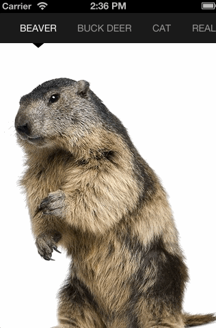

DAPagesContainer
==============

A generic views container with a scrollable top bar
--------------

Just pass the array of view controllers and DAPagesContainer will grab their titles and nicely display them in the top bar. The titles will be aligned properly even if their lengths differ and they do not fit the screen width.

Features
==============

- Both content scroll view and top bar can be used for navigation,
- If a selected view is not the "nearest" neighbor of the current one, all the views in between will be skipped to provide a nice smooth animation,
- Supports user interface orientation rotations,
- Buttons in the top bar change their color as corresponding views become visible.

Installation
==============

CocoaPods
--------------
Install CocoaPods if necessary:

    $ [sudo] gem install cocoapods
    $ pod setup

Change to the directory of your Xcode project:

    $ cd /path/to/MyProject
    $ touch Podfile
    $ edit Podfile

Edit your Podfile and add DAPagesContainer:

    platform :ios, '5.0'
    pod 'DAPagesContainer'

Install into your Xcode project:

    $ pod install

From now on open your project in Xcode from the .xcworkspace file (instead of the usual project file)

Manual Install
--------------

Just drag and drop DAPagesContainer folder into your project.

Usage
==============

Getting started with DAPagesContainer is really simple. Just alloc-init it and assign an array of view controllers. This can be done in the following way:

    self.pagesContainer = [[DAPagesContainer alloc] init];
    [self.pagesContainer willMoveToParentViewController:self];
    self.pagesContainer.view.frame = self.view.bounds;
    self.pagesContainer.view.autoresizingMask = UIViewAutoresizingFlexibleWidth | UIViewAutoresizingFlexibleHeight;
    [self.view addSubview:self.pagesContainer.view];
    [self.pagesContainer didMoveToParentViewController:self];
    self.pagesContainer.viewControllers = @[....];

Customization
==============

Go ahead and experiment with these properties:

    @property (assign, nonatomic) NSUInteger topBarHeight;
    @property (assign, nonatomic) CGSize pageIndicatorViewSize;
    @property (strong, nonatomic) UIColor *topBarBackgroundColor;
    @property (strong, nonatomic) UIFont *topBarItemLabelsFont;
    @property (strong, nonatomic) UIColor *pageItemsTitleColor;
    @property (strong, nonatomic) UIColor *selectedPageItemColor;

TODO
==============

- Add colors customization for title views in top bar (not only shadows of grey)

